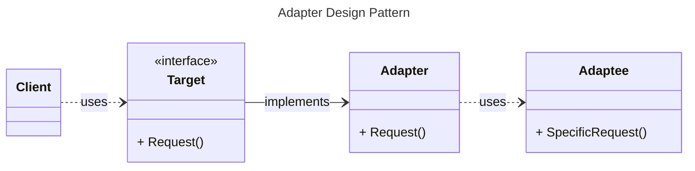

# Design Diagram

```mermaid
---
title: Adapter Design Pattern
---
classDiagram
    direction LR
    Client ..> Target: uses
    Target --> Adapter: implements
    Adapter ..> Adaptee: uses
    class Client {
    }
    class Target {
        <<interface>>
        + Request()
    }
    class Adapter {
        + Request()
    }
    class Adaptee {
        + SpecificRequest()
    }
```
