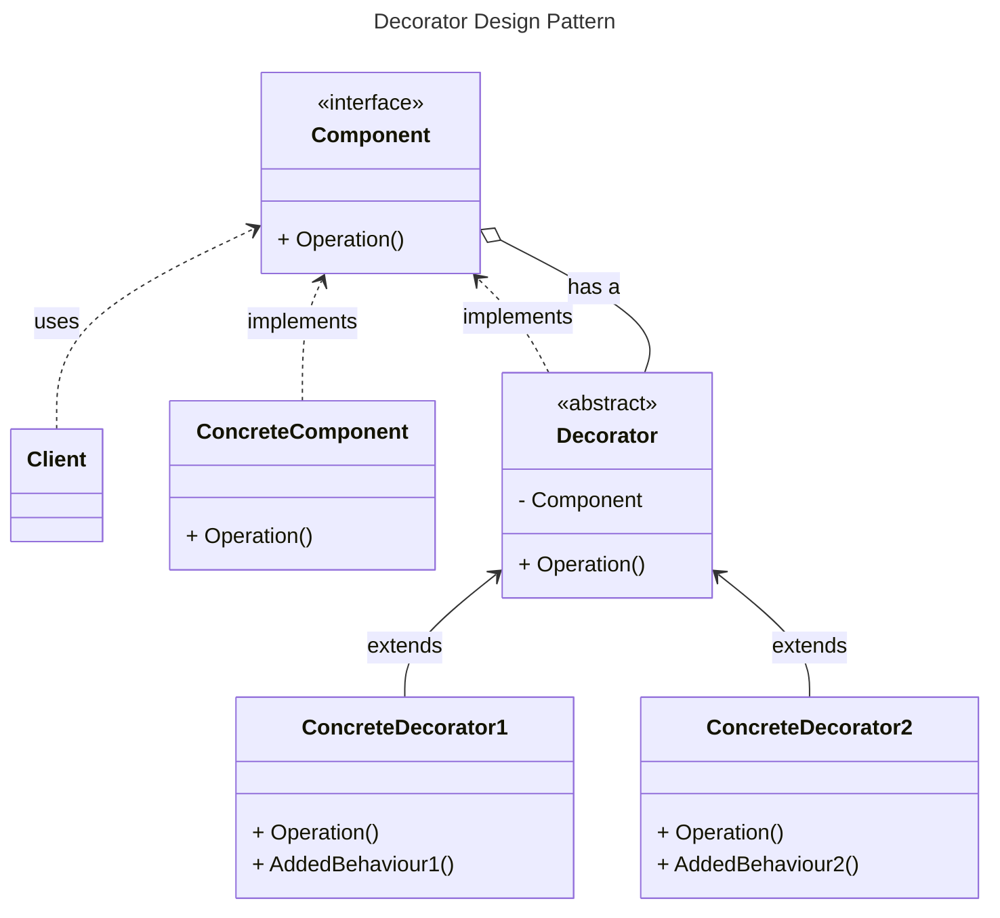

# Design Diagram

```mermaid
---
title: Decorator Design Pattern
---
classDiagram
    direction BT
    Client ..> Component: uses
    ConcreteComponent ..> Component: implements
    Decorator ..> Component: implements
    Decorator --o Component: has a
    ConcreteDecorator1 --> Decorator: extends
    ConcreteDecorator2 --> Decorator: extends
    class Client {
    }
    class Component {
        <<interface>>
        + Operation()
    }
    class ConcreteComponent {
        + Operation()
    }
    class Decorator {
        <<abstract>>
        - Component
        + Operation()
    }
    class ConcreteDecorator1 {
        + Operation()
        + AddedBehaviour1()
    }
    class ConcreteDecorator2 {
        + Operation()
        + AddedBehaviour2()
    }
```
