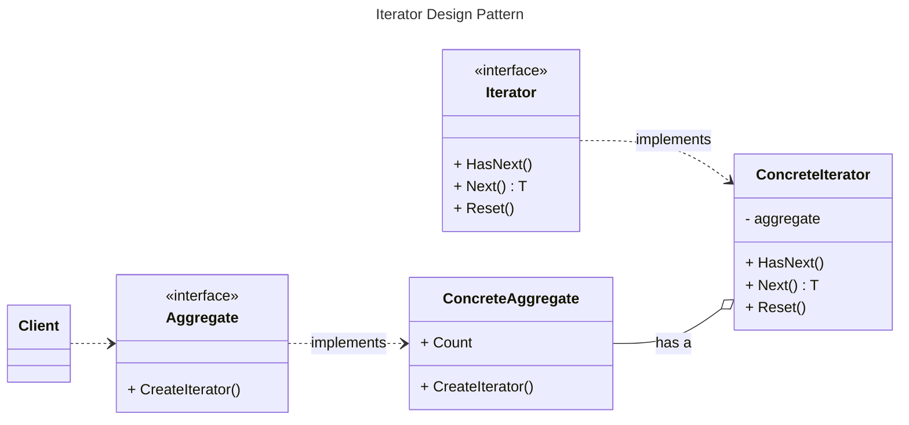

# Design Diagram

```mermaid
---
title: Iterator Design Pattern
---
classDiagram
    direction LR
    Client ..> Aggregate
    Aggregate ..> ConcreteAggregate: implements
    Iterator ..> ConcreteIterator: implements
    ConcreteAggregate --o ConcreteIterator: has a
    class Client {
    }
    class Aggregate {
        <<interface>>
        + CreateIterator()
    }
    class Iterator {
        <<interface>>
        + HasNext()
        + Next() T
        + Reset()
    }
    class ConcreteAggregate {
        + Count
        + CreateIterator()
    }
    class ConcreteIterator {
        - aggregate
        + HasNext()
        + Next() T
        + Reset()
    }
```
