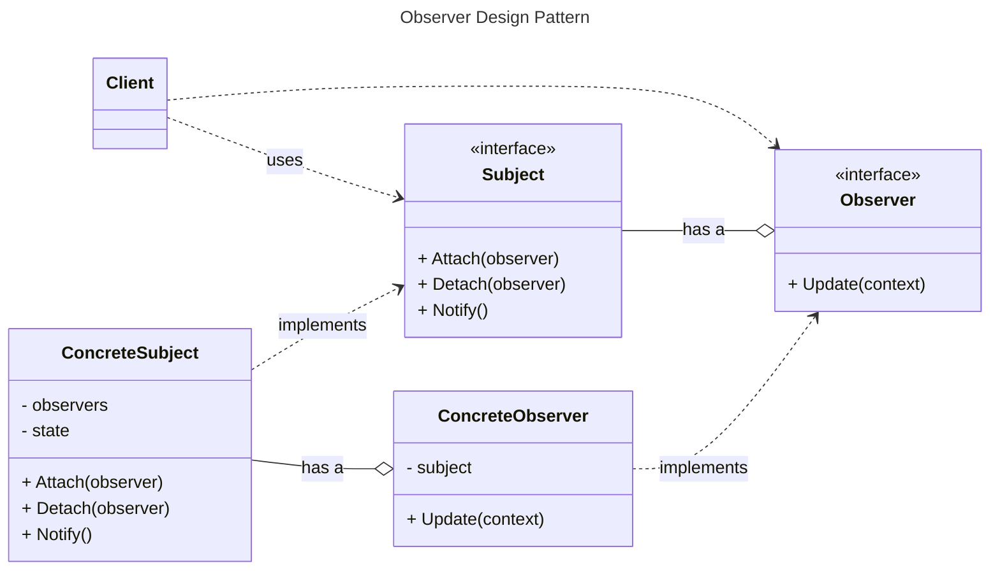

# Design Diagram

```mermaid
---
title: Observer Design Pattern
---
classDiagram
    direction LR
    Client ..> Subject: uses
    Client ..> Observer
    Subject --o Observer: has a
    ConcreteSubject ..> Subject: implements
    ConcreteObserver ..> Observer: implements
    ConcreteSubject --o ConcreteObserver: has a
    class Client {
    }
    class Subject {
        <<interface>>
        + Attach(observer)
        + Detach(observer)
        + Notify()
    }
    class Observer {
        <<interface>>
        + Update(context)
    }
    class ConcreteSubject {
        - observers
        - state
        + Attach(observer)
        + Detach(observer)
        + Notify()
    }
    class ConcreteObserver {
        - subject
        + Update(context)
    }
```
