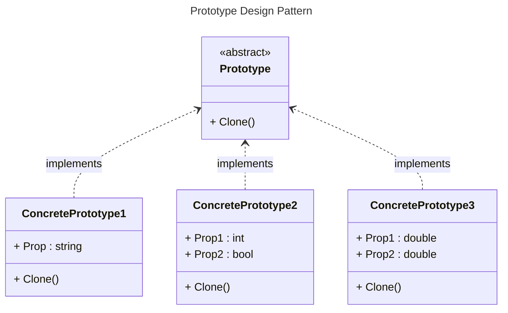

# Design Diagram

```mermaid
---
title: Prototype Design Pattern
---
classDiagram
    direction BT
    ConcretePrototype1 ..> Prototype: implements
    ConcretePrototype2 ..> Prototype: implements
    ConcretePrototype3 ..> Prototype: implements
    class Prototype {
        <<abstract>>
        + Clone()
    }
    class ConcretePrototype1 {
        + Prop : string
        + Clone()
    }
    class ConcretePrototype2 {
        + Prop1 : int
        + Prop2 : bool
        + Clone()
    }
    class ConcretePrototype3 {
        + Prop1 : double
        + Prop2 : double
        + Clone()
    }
```
