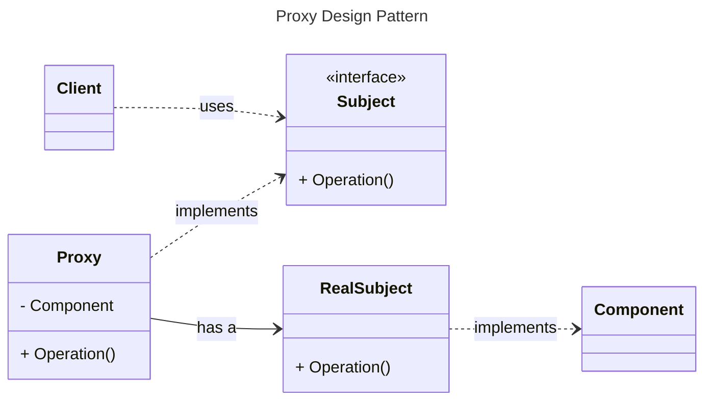

# Design Diagram

```mermaid
---
title: Proxy Design Pattern
---
classDiagram
    direction LR
    Client ..> Subject: uses
    Proxy ..> Subject: implements
    RealSubject ..> Component: implements
    Proxy --> RealSubject : has a
    class Client {
    }
    class Subject {
        <<interface>>
        + Operation()
    }
    class Proxy {
        - Component
        + Operation()
    }
    class RealSubject {
        + Operation()
    }
```
