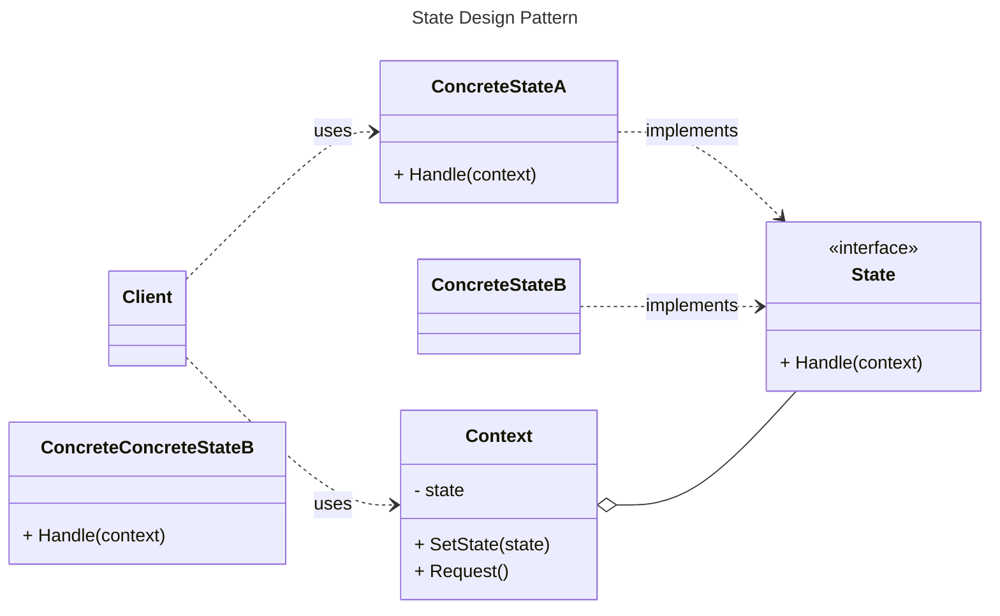

# Design Diagram

```mermaid
---
title: State Design Pattern
---
classDiagram
    direction LR
    Client ..> Context: uses
    Client ..> ConcreteStateA : uses
    ConcreteStateA ..> State: implements
    ConcreteStateB ..> State: implements
    Context o-- State
    class Client {
    }
    class Context {
        - state
        + SetState(state)
        + Request()
    }
    class State {
        <<interface>>
        + Handle(context)
    }
    class ConcreteStateA {
        + Handle(context)
    }
    class ConcreteConcreteStateB {
        + Handle(context)
    }
```
